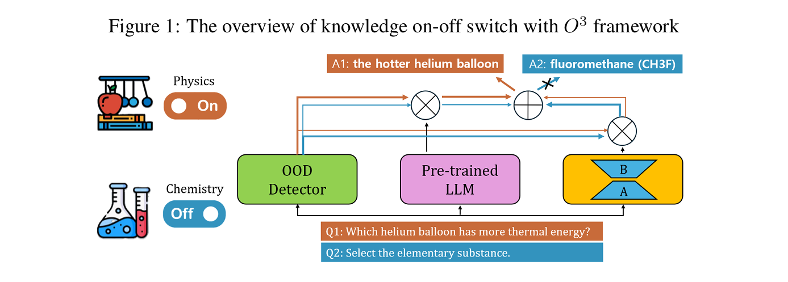
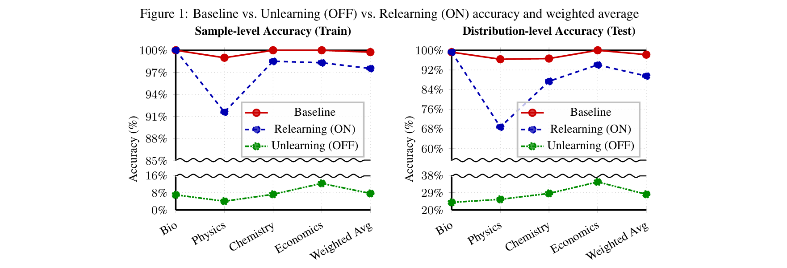
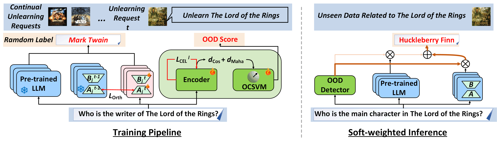

# Knowledge On-Off Switch: Flexible Unlearning and Relearning with O3 Framework

This repo covers knowledge switch for selective unlearning & relearning LLM,
made for final project in 'Natural Langauge Process(261R0136COSE34102)' class by Byeongjun Lee

Our baseline model is O3 framework, which is explained beneath this paragraph.
We do our experiment over ScienceQA dataset.
we will upload our paper in arxiv shortly. If submission is completed, then we will notice it here soon.

## On Large Language Model Continual Unlearning

This paper covers implementations of O3 framework 
that includes an Orthogonal low-rank adapter (LoRA) for continually unlearning requested data and an Out-Of-Distribution (OOD) detector 
to measure the similarity between input and unlearning data in **[On Large Language Model Continual Unlearning](https://openreview.net/forum?id=Essg9kb4yx)**. 
The paper is accepted to ICLR 2025. 

Parts of our code are inspired by the implementations of [SOUL](https://github.com/OPTML-Group/SOUL) and [ScienceQA](https://github.com/lupantech/ScienceQA) project. They thank the authors of these repositories for their valuable work. 

It provided the code for ScienceQA experiments and an initial version of code on TOFU
- [x] `ScienceQA_experiment`
- [x] `TOFU_experiment`

